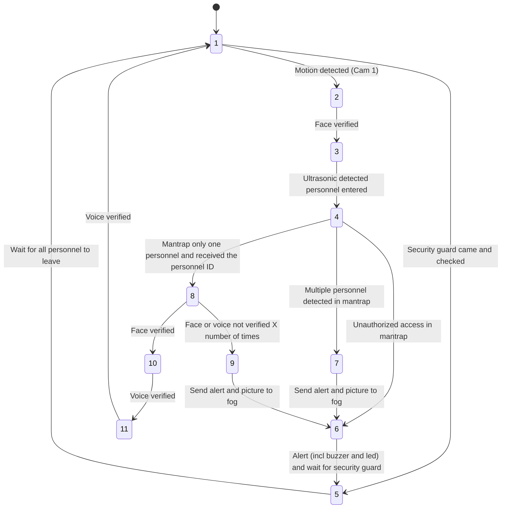

# INF2009-Team6 (EDGE COMPUTING)
Dual-Gate Access Authentication with 2-Factor Authentication (Voice + Camera)

## Project Description
This project is a dual-gate access authentication system that uses 2-factor authentication. The system is composed of two gates. The first camera on first gate is the face recognition gate, which uses the camera to capture the face of the person trying to enter. The second camera on first gate will prevent tailgating. The second gate is the face and voice recognition gate, which uses the camera to capture the face of the person trying to enter and the microphone to capture the voice of the person trying to enter. The system will only allow access if the person is recognized by both gates. The system will also have a web interface that will allow the user to add new users, delete users, and view the logs of the system.

## Setup (TODO: Complete this section)
### Fog Device
1. Install Docker on the fog device.
2. Run the following command to start the MQTT broker container.
    ```bash
    docker run -d --name mqtt-broker \
    -p 1883:1883 \
    -e MOSQUITTO_USERNAME=mosquitto \
    -e MOSQUITTO_PASSWORD=mosquitto \
    ekiost/mqtt-broker:latest
    ```

Optional: Download tools like MQTTX to see the messages being published and subscribed to the MQTT broker.

### Raspberry Pi
Note: You can run this on you local machine for testing purposes.
1. Install dependencies.
    ```bash
    pip install -r src/requirements.txt
    ```
2. Run the `src/gate1.py` script on the Raspberry Pi connected to the first gate.
3. Run the `src/gate2.py` script on the Raspberry Pi connected to the second gate.

## Software and Hardware
### Software
- paho-mqtt
- TODO: Add more software

### Hardware
- Raspberry Pi 4
- Webcam
- Led
- Buzzer
- Ultrasonic sensor

### Communication
The system will use MQTT and REST to communicate between the two gates and the fog device. 

#### MQTT Topics
The system will use the following topics to communicate between the two gates and the fog device.
- `gate_1\status`: This topic is used by the first gate to publish its status. 
    ```json
    {
        "opened": "2025-02-28 21:52:39"
    }
    ```
    ```json
    {
        "closed": "2025-02-28 21:52:39"
    }
    ```
- `gate_2\status`: This topic is used by the second gate to publish its status. 
    ```json
    {
        "opened": "2025-02-28 21:52:39"
    }
    ```
    ```json
    {
        "closed": "2025-02-28 21:52:39"
    }
    ```
- `verified`: This topic is used to tell the second gate that the person has been verified by the first gate. The message will contain the personnel ID of the person.
    ```json
    {
        "personnel_id": "123456"
    }
    ```
- `alert`: This topic is used to send an alert to the fog device and let first gate proceed to the next state.
    ```json
    {
        "message": "multi",
        "picture": "base64 encoded picture"
    }
    ```
    ```json
    {
        "message": "diff",
        "picture": "base64 encoded picture"
    }
    ```
- `command`: This topic is used to send a command to the first gate to open or close the gate.
    ```json
    {
        "command": "open"
    }
    ```
    ```json
    {
        "command": "close"
    }
    ```
- `update/embeddings`: This topic is used to tell the pi to update the embeddings of the personnel.
    ```json
    {
        "face": "filename.pkl",
        "voice": "filename.pkl"
    }

#### API (TODO: Add more details)
The system will use the following API to get the embeddings of the personnel.
- `GET /embeddings/face/filename.pkl`: This API is used to get the face embeddings of the personnel.
- `GET /embeddings/voice/filename.pkl`: This API is used to get the voice embeddings of the personnel.


## Classes
- Gate: this class will represent the gate and will have the following class
    - EventManager: this class will manage the events that occur at the gate from the MQTT broker
    - StateManager: this class will manage the state of the gate
    - UpdateManager: this class will manage the updates that occur at the gate from the MQTT broker
- Network: 
    - MQTT:
        - Publisher: this class will publish messages to the MQTT broker
        - Subscriber: this class will subscribe to messages from the MQTT broker
    - API:
        - UpdateDownloader: this class will download the embeddings of the personnel from the API
- Utils:
    - LoggerMixin: this class will log the messages to the console 
- Enums:
    - GateState: this enum will represent the state of the gate
    - GateType: this enum will represent the type of the gate

## State Diagram
The state table and state diagram are shown below. The state diagram is a visual representation of the state table. The state table shows the states of the system, the conditions that trigger the transitions between states, and the actions to take when transitioning between states. The state diagram shows the states of the system as nodes and the transitions between states as edges. The state diagram is a useful tool for understanding the behavior of the system and for designing the system.




| State ID | Gate 1 Status | Mantrap Status | Gate 2 Status | Condition | Preceding States | Next States | Action to take |
|----------|--------------|----------------|---------------|-----------|------------------|-------------|----------------|
| 1 | Close | Idle | Close | Default, Face not verified | *, 2, 5, 11 | 2 | Wait for personnel to approach |
| 2 | Face | Idle | Close | Motion detected (Cam 1) | 1 | 1, 3 | Enable facial verification (Cam 1) |
| 3 | Open | Idle | Close | Face verified | 2 | 4 | Wait for personnel to enter mantrap |
| 4 | Close | Scan | Close | Ultrasonic detected personnel entered | 3 | 7, 8 | Enable human detection scan (Cam 2) |
| 5 | Open | Checked | Close | Security guard came and checked | 6 | 1 | Wait for all personnel to leave |
| 6 | Close | Alert | Close | Unauthorized access in mantrap | 7 | 5 | Alert (incl buzzer and led) and wait for security guard |
| 7 | Close | Multi | Close | Multiple personnel detected in mantrap | 4 | 6 | Send alert and picture to fog |
| 8 | Close | Idle | Face | Mantrap only one personnel and received the personnel ID | 4 | 9, 10 | Enable facial verification (Cam 3) |
| 9 | Close | Idle | Diff | Face or voice not verified X number of times | 8 | 6 | Send alert and picture to fog |
| 10 | Close | Idle | Voice | Face verified | 8 | 9, 11 | Enable voice verification (Cam 3) |
| 11 | Close | Idle | Open | Voice verified | 10 | 1 | Wait for personnel to exit the mantrap |
# 🚀 Developer's Diary
## 🔊 Voice Authentication
As voice authentication was a vital part of the authentication process, including both the voice password and the voice signature analysis, the system was broken down into two parts accordingly.

### 1️⃣ Starting Premise
📡 The edge devices would be connected through LAN cables to the internet, providing secured access through the premise's internet and firewall. 

🔍 The voice authentication process occurs **after** confirming the identity of the personnel, meaning there is no need to determine their identity beforehand.

💾 Voice enrollment is performed on the fog device, while authentication is carried out on the edge. Thus, updates to personnel’s unique voice passwords are transferred from the fog device to the edge device.

🔒 Ensuring the **security** of voice authentication during these updates is **critical**.

### ⚙️ Approach to Premise
✅ A **simple solution** was chosen to match voice signatures and passwords **without** relying on deep learning models (which can be heavyweight and have costlier inference). 

📉 The approach involves matching voice signatures by calculating the **linear normalized distance** of the MFCC features between the enrolled and authentication voice samples. This allows developers to **customize a threshold value** based on testing to separate voice signatures.

🎙️ A **speech recognition library** was used to capture the voice passwords. Both speed ⚡ and accuracy 🎯 were crucial, leading to testing (below) to identify the most suitable library.

🔐 After recognition, **voice passwords are hashed and serialized** for secure transmission to the edge device.

### 🧪 Testing
🛠️ Five speech recognition models were tested:
- Sphinx
- Google Speech Recognition
- Wit.ai
- Houdify
- Whisper

🏆 **Google Speech Recognition** provided the **best accuracy** and **speed** for word inference.

⏳ Since authentication involves waiting, minimizing **wait times** was a priority.


### 🚨 Problems Encountered
🛠️ Due to differences in **hardware** on edge and fog devices, the team suspected a **significant amount of noise** was picked up by the edge device. 

🎤 **Fog devices (often laptops) apply noise reduction automatically**, leading to cleaner recordings. 

❌ Edge devices, however, recorded **noisier audio**, causing **failed authentication attempts**.

### 🛠️ Solutions Employed
🔀 The team **split development** into two alternate paths:

1️⃣ **Lightweight approach** (MFCC features comparison)
   - 🛠️ **Noise reduction** using the `noisereduce` library when recording on the edge device.
   - 🎚️ A **first authentication pass** using the noise-reduced WAV file to extract MFCC features.
   - 🔍 If this **fails**, a **second authentication pass** applies **noise-reduction on MFCC features** instead.

2️⃣ **Noise-reduction profile development**
   - 📊 **Recorded samples** from fog and edge devices were analyzed.
   - 📈 **Signal-to-noise ratio** was calculated for each feature.
   - 🔢 Features were adjusted by a **scale factor** to improve authentication accuracy.

📊 **Example testing results**:


📌 **Observations**:
- ✅ **Same individual authentication**: After denoising, embedding distance **reduced by 57 points** (125.39 → 67.61).
- ❌ **Different individual authentication**: Embedding distance **only reduced by 10 points** (104.06 → 93.69).

💡 This **simpler algorithm** selectively **reduces embeddings using noise estimates**, enabling **more reliable authentication** across **Fog and Edge devices** without deep learning.

### 🧠 Alternative Deep Learning Approach
🤖 **Deep-learning-based method**:
- Utilized `resemble-ai/Resemblyzer` ([GitHub](https://github.com/resemble-ai/Resemblyzer))
- Generates a **256-value summary vector** per audio file.

⚖️ **Comparison**:
| Approach | Features Used | Speed ⏳ | Storage 📦 | Noise Handling 🎧 |
|----------|--------------|---------|----------|----------------|
| **Lightweight (MFCC)** | 20 values | ✅ Fast | ✅ Low | ⚠️ Moderate |
| **Deep Learning (Resemblyzer)** | 256 values | ❌ Slower | ❌ High | ✅ Strong |

🔍 The **deep-learning approach** accounts **better** for:
- 🔊 **Different recording hardware**
- 🎧 **Environmental noise**
  
However, it has **higher inference time** ⏳ and **storage costs** 📦.

---
✅ **Final Decision:**  
For **lightweight** and **efficient** authentication across devices, **the MFCC-based approach was prioritized**. Deep learning remains an **alternative** for future enhancements.

🚀 **Next Steps:**
- Optimize **threshold calibration** for different noise profiles.
- Improve **real-time denoising** on edge devices.
- Evaluate **hybrid approaches** for further robustness.

---
🎉 **Conclusion:**  
Through **adaptive noise reduction** and **threshold tuning**, a **lightweight, scalable** voice authentication system was implemented—ensuring **fast, reliable** authentication without **heavy AI dependency**.

