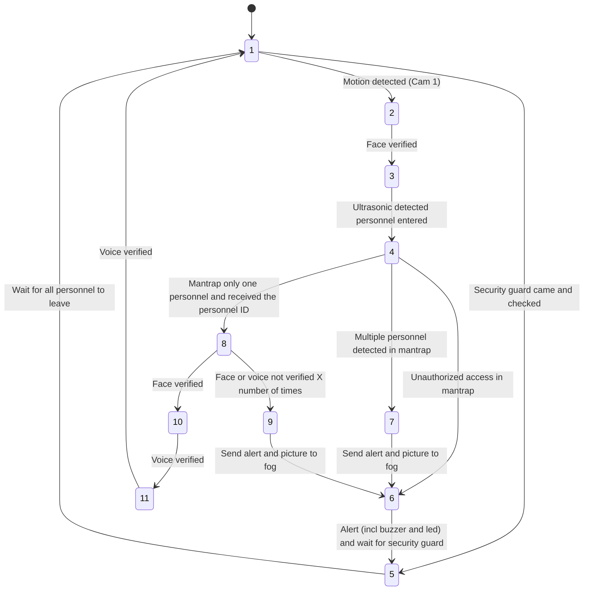

# **GateGuard**: Dual-Gate Access Authentication with Multi-Factor Authentication (Face + Voice Passphrase & Signature)


## Project Description

This project is a dual-gate access authentication system that uses multi-factor authentication. The system is composed of two gates. The first camera on the first gate is the face recognition gate, which uses the camera to capture the face of the person trying to enter. The second camera on the first gate will prevent tailgating. The second gate is the face and voice recognition gate, which uses the camera to capture the face of the person trying to enter and the microphone to capture both the voice passphrase and voice signature of the person. The system will only allow access if the person is recognized by all required factors across both gates. The system will also have a web interface that will allow the user to add new users, delete users, and view the logs of the system. To achieve low-latency, real-time decision-making, the system processes biometric data directly on edge devices. This edge-based architecture not only reduces latency but also enhances privacy by keeping sensitive biometric data local to the devices on-premise.


## 🔗 Links

[](https://www.canva.com/design/DAGcoSWfQ7E/206BhRh_AZRSofwBzGcc8g/view?utm_content=DAGcoSWfQ7E&utm_campaign=designshare&utm_medium=link2&utm_source=uniquelinks&utlId=hceeff75b2a)

[](https://github.com/junxianyong/INF2009-Team6/blob/main/fog/user_guide.md)

[](https://github.com/junxianyong/INF2009-Team6/blob/main/fog/api_reference.md)

## Task / Work Allocation

The project tasks have been divided among team members.

- **Ernest**
	- **Voice Signature and Passphrase Authentication**:
	  - Develop the voice signature matching algorithm using MFCC features.
	  - Implement voice passphrase recognition using Google Speech Recognition.
	  - Optimize noise reduction techniques for edge devices using the `noisereduce` library.
	  - Test and calibrate thresholds for voice authentication accuracy.

- **Jun Xian**
	- **Motion Detection**:
	  - Implement motion detection using OpenCV for detecting personnel approaching the gate.
	  - Optimize motion detection parameters (e.g., resolution, threshold, and frame rate).
	- **Face Authentication**:
	  - Develop face recognition pipeline using MobileFaceNet and MediaPipe.
	  - Implement enhanced image preprocessing techniques (e.g., white balance correction, gamma correction).
	  - Build the face embeddings database for personnel verification.
	- **Profiling for Face Authentication**:
	  - Profile the performance of face detection and embedding generation pipelines.
	  - Measure system metrics such as CPU usage, memory usage, and processing time for face authentication.

- **Benjamin**
	- **Tailgating Overhead Multi-Personnel Detection**:
	  - Implement human detection using YOLOv5 TFLite models.
	  - Test and evaluate the system for accuracy.

- **Choon Keat**
	- **Gate Integration and Sensors**:
	  - Integrate hardware components such as ultrasonic sensors, buzzers, and servos with the system.
	  - Develop drivers for hardware components and ensure compatibility with Raspberry Pi.
	  - Implement gate state management and transitions based on sensor inputs.
	- **MQTT Communication**:
	  - Set up MQTT topics for communication between gates and the fog device.
	  - Implement MQTT publishers and subscribers for real-time data exchange.

- **Chee Hean**
    - **Fog Dashboard Integration**:
        - Develop the web interface for managing users, logs, and system configurations.
        - Implement API endpoints for communication between the fog device and edge devices.
        - Ensure secure data transmission between the fog dashboard and edge devices.
	- **MQTT Communication**:
	  - Coordinate MQTT integration with the fog device for real-time updates and alerts.
	- **Profiling for Voice Authentication**:
	  - Profile the performance of voice authentication solutions.
	  - Measure system metrics such as memory usage, bandwidth and processing time for voice authentication.

## Setup Instructions

### Fog Device (PC)

1. Ensure that the following software is installed.
   - [Docker](https://www.docker.com/)
   - [Python 3.12.5 or later](https://www.python.org/downloads/release/python-3125/)
   - [Node v20.14.0 or later](https://nodejs.org/en)
   - [PostgreSQL 17.2 or later](https://www.postgresql.org/download/)

2. Run the MQTT broker container:
   ```bash
   docker run -d --name mqtt-broker \
   -p 1883:1883 \
   -e MOSQUITTO_USERNAME=your_mqtt_username \
   -e MOSQUITTO_PASSWORD=your_mqtt_password \
   ekiost/mqtt-broker:latest
   ```
   
3. Run the Nginx container (optional):

   This container provides an SSL connection with a self-signed certificate to the browser and routes traffic to the NextJS web client and Flask web server.
   This is required if you wish to access the web portal from a remote machine, as most browsers restrict access to device camera and microphone
   (for biometrics enrollment) for non-localhost HTTP connections.\
   `host.docker.internal` will point to the host where the Docker runtime is on, replace the values accordingly if the NextJS and Flask server are running
   on other machines.

    ```bash
   docker run -d --name nginx-selfsigned-ssl \
   -p 80:80 -p 443:443 \
   -e FRONTEND_SERVER=host.docker.internal:3000 \
   -e BACKEND_SERVER=host.docker.internal:5000 \
   limcheehean/nginx-selfsigned-ssl:latest
   ```
4. Import database schema and data.
   ```bash
   psql -h localhost -u your_db_username -P your_db_password < fog/web_server/utils/db.sql 
   ```
5. Create environment configuration files:

   #### For web_server (.env.local)
   Create this file in the fog/web_server directory with the following structure:
   ```
   SECRET_KEY=your_secret_key
   SESSION_TIMEOUT=1200
   
   # SMTP Configuration
   SMTP_SERVER=your_smtp_server
   SMTP_PORT=587
   SMTP_LOGIN=your_email@example.com
   SMTP_PASSWORD=your_smtp_password
   
   # Database Configuration
   DB_NAME=gateguard
   DB_USER=your_db_username
   DB_PASSWORD=your_db_password
   DB_HOST=localhost
   DB_PORT=5432
   
   # MQTT Configuration
   MQTT_BROKER=localhost
   MQTT_PORT=1883
   MQTT_CLIENT_ID=fog
   MQTT_USERNAME=your_mqtt_username
   MQTT_PASSWORD=your_mqtt_password
   
   # API Token
   EMBEDDINGS_TOKEN=your_embeddings_token
   
   TF_ENABLE_ONEDNN_OPTS=0
   ```

   #### For web_client (.env.local)
   Create this file in the fog/web_client directory:\
   _For development on localhost only_
   ```
   NEXT_PUBLIC_API_URL=http://localhost:5000/api
   ```
   _For access via an Nginx proxy (as described in step 3)_
   ```
   NEXT_PUBLIC_API_URL=/api
   ```

6. Install backend dependencies:
   ```bash
   cd fog/web_server
   
   pip install virtualenv
   python -m venv .venv
   
   .venv\Scripts\activate     # For Windows
   source .venv/bin/activate  # For macOS/Linux
   
   pip install -r requirements.txt
   ```

7. Start the web server:
   ```bash
   set FLASK_ENV=development    # For Windows
   export FLASK_ENV=development # For macOS/Linux
   
   python app.py
   ```

8. Install frontend dependencies:
   ```bash
   cd fog/web_client
   npm install
   ```

9. Start the web client:
   ```bash
   npm run dev
   ```

### Edge Device (Raspberry Pi)

1. Install required dependencies:
   ```bash
   pip install -r requirements.txt
   ```

2. Run the gate applications:
    - For the first gate: `python gate1.py`
    - For the second gate: `python gate2.py`

## Configuration Options

The system can be customized through the following configuration dictionaries:

### MQTT Configuration

```python
mqtt_config = {
    "broker": "localhost",  # Change to your MQTT broker address
    "port": 1883,
    "username": "your_mqtt_username",
    "password": "your_mqtt_password",
}
```

### API Configuration

```python
update_config = {
    "url": "localhost:5000/api/biometrics/embeddings/<EMBEDDINGS_TOKEN>/",
    "save_path": "update",
}
```

### Motion Detection Configuration

```python
motion_detector_config = {
    "camera_id": 0,  # Change to your camera index
    "resolution": (320, 240),
    "threshold": 25,
    "min_area": 500,
    "blur_size": 5,
    "check_interval": 0.5,  # Check every 0.5s
    "fps": 10,  # 10fps for responsive but lower CPU usage
}
```

### Face Verification Configuration

```python
face_verification_config = {
    "model_path": "model/mobilefacenet.tflite",
    "database_path": "update/face_embeddings.pkl",
    # Face detection & preprocessing settings:
    "model_selection": 0,
    "min_detection_confidence": 0.7,
    "padding": 0.2,
    "face_required_size": (512, 512),
    "target_size": (112, 112),
    # Verification settings:
    "verification_threshold": 0.7,
    "verification_timeout": 30,
    "verification_max_attempts": 3,
    # Camera settings:
    "camera_id": 0,  # Change to your camera index
}
```

### Intruder Detection Configuration

```python
intruder_detection_config = {
    "camera_index": 0,  # Change to your camera index
    "model": "model/yolov5n-fp16.tflite",
    "confidence": 0.2,
    "iou_threshold": 0.2,
    "directions": {"total": None, "inside": "bottom", "outside": "top"},
    "duration": 30,
    "sensitivity": 0.05
}
```

### Hardware Driver Configuration

```python
driver_config = {
    "buzzer": {
        "pin": 17
    },
    "lcd": {
        "address": 0x27,
        "port": 1,
        "cols": 16,
        "rows": 2,
        "dotsize": 8,
    },
    "servo": {
        "pin": 4,
        "open_angle": 180,
        "close_angle": 0,
    },
    "ultrasonic": {
        "echo": 23,
        "trigger": 18,
        "max_distance": 4,
        "window_size": 10,
        "calibration_step": 30,
    }
}
```

## Models

### Face Recognition Models

Additional pre-trained models can be downloaded for the purpose of using the face profiling script from [this link](https://drive.google.com/drive/folders/1eMMwx83z2gOaQSYb-AWKj05oLTAsBKvx?usp=drive_link).

# Documentation

## 1. Features

These are the libraries and hardware modules used within this project. (Not exhaustive)

### 1.1 💻Software

- paho-mqtt
- Flask, React (Next js)
- noisereduce (noise reduction for sound)
- resemblyzer (Deep-learning sound embedding)
- Google Speech Recognition
- Librosa
- MediaPipe
- Yolov5
- Docker

### 1.2 🪫Hardware

- Raspberry Pi 4/5
- Webcam w/ inbuilt microphone
- I2C LCD
- Buzzer
- Ultrasonic sensor
- Servo

## 2. 🗣️ Communication

The system will use MQTT and REST to communicate between the two gates and the fog device.

### 2.1 MQTT Topics

The system will use the following topics to communicate between the two gates and the fog device.

- `gate_1\status`: This topic is used by the first gate to publish its status.
    ```json
    {
        "opened": "2025-02-28 21:52:39"
    }
    ```
    ```json
    {
        "closed": "2025-02-28 21:52:39"
    }
    ```
- `gate_2\status`: This topic is used by the second gate to publish its status.
    ```json
    {
        "opened": "2025-02-28 21:52:39"
    }
    ```
    ```json
    {
        "closed": "2025-02-28 21:52:39"
    }
    ```
- `verified`: This topic is used to tell the second gate that the person has been verified by the first gate. The
  message will contain the personnel ID of the person.
    ```json
    {
        "personnel_id": "123456"
    }
    ```
- `alert`: This topic is used to send an alert to the fog device and let first gate proceed to the next state.
    ```json
    {
        "message": "multi",
        "picture": "base64 encoded picture"
    }
    ```
    ```json
    {
        "message": "diff",
        "picture": "base64 encoded picture"
    }
    ```
- `command`: This topic is used to send a command to the first gate to open or close the gate.
    ```json
    {
        "command": "open"
    }
    ```
    ```json
    {
        "command": "close"
    }
    ```
- `update/embeddings`: This topic is used to tell the pi to update the embeddings of the personnel.
    ```json
    {
        "face": "filename.pkl",
        "voice": "filename.pkl"
    }

### 2.2 API

The detailed API documentation is available [in a separate link](https://github.com/junxianyong/INF2009-Team6/blob/main/fog/api_reference.md).

**Authentication**

* `[POST] /api/auth/login`: Login to the security portal. (Access: Admin, Security)
* `[GET] /api/auth/logout`: Logout from the security portal. (Access: Admin, Security)

**User**

* `[POST] /api/user/list`: List users in the system. (Access: Admin)
* `[POST] /api/user/add`: Add new user into the system. (Access: Admin)
* `[POST] /api/user/update/<user_id>`: Update user details. (Access: Admin)
* `[DELETE] /api/user/delete/<user_id>`: Delete user from the system. (Access: Admin)

**Mantrap**

* `[POST] /api/mantrap/list`: List mantraps in the system. (Access: Admin, Security)
* `[POST] /api/mantrap/add`: Add a new mantrap into the system. (Access: Admin)
* `[POST] /api/mantrap/update/<mantrap_id>`: Update mantrap details. (Access: Admin)
* `[DELETE] /api/mantrap/delete/<mantrap_id>`: Remove mantrap from the system. (Access: Admin)
* `[GET] /api/mantrap/<mantrap_id>/<action>`: Manually override gate status of mantrap. (Access: Admin, Security)

**Biometrics**

* `[POST] /api/biometrics/enroll/<user_id>`: Enroll user biometrics. (Access: Admin)
* `[DELETE] /api/biometrics/delete/<user_id>`: Delete user biometrics. (Access: Admin)
* `[GET] /api/biometrics/embeddings/<token>/<filename>`: Retrieve latest biometrics embeddings. (Access: Edge Device (Raspberry Pi))

**Access Logs**

* `[POST] /api/log/list`: List system logs. (Access: Admin, Security)
* `[GET] /api/log/file/<filename>`: Get file (image) associated with log. (Access: Admin, Security)

### 2.3 Classes

- Gate: this class will represent the gate and will have the following class
    - EventManager: this class will manage the events that occur at the gate from the MQTT broker
    - StateManager: this class will manage the state of the gate
    - UpdateManager: this class will manage the updates that occur at the gate from the MQTT broker
- Network:
    - MQTT:
        - Publisher: this class will publish messages to the MQTT broker
        - Subscriber: this class will subscribe to messages from the MQTT broker
    - API:
        - UpdateDownloader: this class will download the embeddings of the personnel from the API
- Utils:
    - LoggerMixin: this class will log the messages to the console
- Enums:
    - GateState: this enum will represent the state of the gate
    - GateType: this enum will represent the type of the gate

## 3. 🪪 Face Verification

### 3.1 Main Files

- **debug_mobilefacenet.py**: Script to debug and get details on the TensorFlow and TFLite MobileFaceNet model.
- **face_profiling.py**: Performance profiling tool for face detection and embedding generation pipelines.
- **face_verification_mobilefacenet.py**: Main script for face verification using MobileFaceNet TFLite model and
  MediaPipe for face detection.
- **motion_detection.py**: Script for motion detection using OpenCV.

### 3.2 Models and Data

- **mobilefacenet_tf.pb**: MobileFaceNet model in TensorFlow PB format.
- **mobilefacenet.tflite**: MobileFaceNet model in TFLite format.
- **face_embeddings.pkl**: Pickle file containing face embeddings.
- **vgg16_feature_extractor.h5**: VGG16 model.
- **vgg16_feature_extractor.tflite**: VGG16 TFLite quantized format.

### 3.3 Directories

- **saved_faces/**: Directory to store saved face images.

### 3.4 Functionality

#### 3.4.1 Face Verification with MobileFaceNet TFLite and MediaPipe

This section details how the face verification system works using the `face_verification_mobilefacenet.py` script. It
uses the MobileFaceNet TFLite model for generating face embeddings and MediaPipe for face detection.

#### 3.4.2 Configuration

The system can be configured through a dictionary containing various parameters:

```python
face_verification_config = {
    "model_path": "mobilefacenet.tflite",
    "database_path": "face_embeddings.pkl",
    # Face detection & preprocessing settings:
    "model_selection": 0,
    "min_detection_confidence": 0.7,
    "padding": 0.2,
    "face_required_size": (512, 512),
    "target_size": (112, 112),
    # Verification settings:
    "verification_threshold": 0.7,
    "verification_timeout": 30,
    "verification_max_attempts": 3,
    # Camera settings:
    "camera_id": 0,
}
```

#### 3.4.3 Enhanced Image Preprocessing

The system includes advanced image preprocessing techniques to improve face recognition accuracy:

1. **White Balance Correction**: Adjusts color balance using LAB color space
2. **Adaptive Gamma Correction**: Dynamically adjusts image brightness based on average luminance
3. **Contrast Normalization**: Enhances image contrast using LAB color space
4. **Model-Specific Normalization**: Applies final normalization based on model requirements

#### 3.4.4 Workflow:

1. **Face Detection**: Utilizes MediaPipe's face detection model to locate faces with configurable confidence threshold
2. **Face Extraction**: Extracts the detected face with configurable padding and resizing
3. **Preprocessing**: Applies enhanced image preprocessing pipeline
4. **Embedding Generation**: Generates a 512-dimensional face embedding vector using MobileFaceNet
5. **Verification**: Compares embeddings using cosine similarity with configurable threshold

#### 3.4.5 Key Functions:

- `detect_face()`: Face detection with MediaPipe
- `extract_face()`: Face extraction with padding
- `preprocess_face()`: Enhanced image preprocessing pipeline
- `get_face_embedding()`: Face embedding generation
- `verify_face()`: Face verification against database
- `wait_for_face_and_verify()`: Interactive verification with timeout and retry
- `build_embedding_from_folder()`: Build embeddings database from folder structure
- `build_embedding_from_images()`: Build embeddings from image list
- `capture_mismatch()`: Capture and encode mismatched faces

#### 3.4.6 Embeddings Storage and Database Management

The system uses a flexible database structure for storing face embeddings:

```python
# Example embeddings database structure
{
    "person1_name": [
        embedding1,  # numpy array of shape (512,)
        embedding2,  # Multiple embeddings per person
        ...
    ],
    "person2_name": [
        embedding1,
        ...
    ]
}
```

#### 3.4.7 Key features:

- **Multiple Embeddings**: Stores multiple embeddings per person for better recognition
- **Persistent Storage**: Saves embeddings to disk using pickle serialization
- **Database Management**:
    - `save_face_embeddings()`: Merges new embeddings with existing database
    - `load_face_embeddings()`: Loads embeddings from disk with error handling
    - `build_embedding_from_folder()`: Builds database from folder structure
    - `build_embedding_from_images()`: Builds database from image list

Folder structure for training data:

```
faces/
├── person1_name/
│   ├── image1.jpg
│   ├── image2.jpg
│   └── ...
├── person2_name/
│   ├── image1.jpg
│   └── ...
```

#### 3.4.8 Key Functions:

- `detect_face()`: Detects faces in a frame using MediaPipe.
- `extract_face()`: Extracts a face from a frame with padding.
- `preprocess_face()`: Preprocesses the face image for the MobileFaceNet model.
- `get_face_embedding()`: Generates the face embedding vector using the MobileFaceNet TFLite model.
- `build_embeddings_from_folder()`: Builds a database of face embeddings from images in a folder.
- `verify_face()`: Verifies a face against the embeddings database.
- `wait_for_face_and_verify()`: Waits for a face to appear and then verifies it against the database.

#### 3.4.9 Profiling

The `face_profiling.py` script is designed to profile the performance of different face detection and embedding methods.
It measures the time taken for each step in the face processing pipeline and collects system metrics such as CPU usage,
memory usage, and I/O operations.

##### 3.4.9.1 Workflow

1. **Initialization**: Initializes the FaceProfiler with specified models and configurations.
2. **Image Loading**: Loads an image for processing.
3. **Face Detection**: Detects faces in the image using either MediaPipe or OpenCV.
4. **Face Extraction**: Extracts the detected face from the image.
5. **Preprocessing**: Preprocesses the extracted face to match the input requirements of the chosen embedding model.
6. **Embedding Generation**: Generates a face embedding vector using the specified model (MobileFaceNet, VGG16, etc.).
7. **Metrics Collection**: Collects timing information for each step and system metrics such as CPU usage, memory usage,
   and I/O operations.
8. **Reporting**: Prints a detailed report of the profiling results, including timing information and system metrics.

##### 3.4.9.2 Key Components

- `FaceProfiler` class: Manages the face detection, extraction, preprocessing, and embedding generation processes.
- `profile_pipeline()` function: Executes the face processing pipeline and collects timing and system metrics.
- `print_profiling_results()` function: Prints a detailed report of the profiling results.

##### 3.4.9.3 Results

The following results were obtained when performing profiling on a Raspberry Pi 5.

**Model Loading**

| Model                  | Model Size (MB) | Memory Usage (MB) | CPU Usage (%) | Load Time (seconds) |
|------------------------|-----------------|-------------------|---------------|---------------------|
| MobileFaceNet (TFLite) | 5.0             | 17.5              | 98.9          | 0.01                |
| VGG (TFLite)           | 128.2           | 283.5             | 100.9         | 0.38                |
| MobileFaceNet (PB)     | 5.2             | 52.73             | 99.9          | 1.48                |
| VGG (Keras)            | 512.2           | 585.83            | 91.7          | 5.4                 |

**Pipeline**

| Framework | Model                  | Detection (seconds) | Extraction (seconds) | Preprocessing (seconds) | Embedding (seconds) | TotalPipeline Time (seconds) | Function Calls | Primitive Calls |
|-----------|------------------------|---------------------|----------------------|-------------------------|---------------------|------------------------------|----------------|-----------------|
| MediaPipe | MobileFaceNet (TFLite) | 0.0207              | 0                    | 0.0038                  | 0.0246              | 0.049                        | 8003           | 7768            |
| MediaPipe | MobileFaceNet (PB)     | 0.0213              | 0                    | 0.0039                  | 0.0357              | 0.0609                       | 8604           | 8203            |
| OpenCV    | MobileFaceNet (TFLite) | 0.0465              | 0.0001               | 0.0037                  | 0.0246              | 0.0749                       | 377            | 372             |
| OpenCV    | MobileFaceNet (PB)     | 0.0452              | 0.0001               | 0.0039                  | 0.0353              | 0.0845                       | 682            | 669             |
| MediaPipe | VGG (TFLite)           | 0.0211              | 0                    | 0.0094                  | 0.2534              | 0.2839                       | 8004           | 7769            |
| OpenCV    | VGG (TFLite)           | 0.0545              | 0.0001               | 0.0095                  | 0.2516              | 0.3156                       | 378            | 373             |
| MediaPipe | VGG (Keras)            | 0.0227              | 0                    | 0.0101                  | 0.7241              | 0.7569                       | 473804         | 454125          |
| OpenCV    | VGG (Keras)            | 0.0552              | 0.0001               | 0.0099                  | 0.7708              | 0.836                        | 71530          | 68144           |

Based on the profiling results:

* **Model Loading:** VGG (Keras) has the largest model size and load time, while MobileFaceNet (TFLite) is the smallest
  and fastest to load.
* **Pipeline Performance:** MobileFaceNet (TFLite) with MediaPipe offers the fastest total pipeline time. VGG (Keras) is
  significantly slower, especially in the embedding generation step.
* **Framework Impact:** MediaPipe generally results in faster face detection compared to OpenCV.
* **Model Format Matters:** TFLite models are generally faster than their TensorFlow Frozen Graph (PB) or Keras
  counterparts.
* **Function Calls:** VGG (Keras) has a significantly higher number of function calls, indicating greater complexity or
  overhead.

## 4. 🚶‍♂️‍➡️ Motion Detection

The `motion_detection.py` script implements motion detection using OpenCV.

### 4.1 Workflow:

1. **Frame Capture**: Captures video frames from a specified camera.
2. **Preprocessing**: Converts each frame to grayscale and applies a Gaussian blur to reduce noise.
3. **Motion Detection**: Compares the current frame with the previous frame to identify differences. Thresholding is
   applied to highlight significant changes.
4. **Contour Detection**: Identifies contours in the thresholded image, representing areas of motion.
5. **Motion Indication**: If the area of any contour exceeds a predefined minimum area, motion is considered detected,
   and a message is printed.

### 4.2 Key Parameters:

- `camera_id`: ID of the camera to use.
- `resolution`: Resolution of the captured video.
- `threshold`: Threshold value for motion detection.
- `min_area`: Minimum area of a contour to be considered motion.
- `blur_size`: Size of the Gaussian blur kernel.
- `check_interval`: Time interval between motion checks.

## 5. 🧑‍🤝‍🧑 Human detection

Within the airlock itself, we should only allow 1 person in at a single moment. Hence, we have to detect if multiple
people are within it.

There are multiple ways of doing so: we can use opencv natively and code out a human detection. This is simple and
extremely lightweight, but highly inefficient due to how insufficiently trained it is.


*OpenCV incorrectly detecting humans*

Another method of approaching this is to use Tensorflow Lite human detection system built on top of YOLOv5 tflite model.
Utilizing both Tensorflow lite and YOLOv5 models, this human detection system is much more effective in accruately
detecting people, especially when there is multiple people (i.e. detecting a city square). Although, a stronger hardware
would be required.


*YOLOv5 tflite detecting humans more efficiently in a crowded square*

## 6. 🔊 Voice Authentication

As voice authentication was a vital part of the authentication process, including both the voice password and the voice
signature analysis, the system was broken down into two parts accordingly.

### 6.1 1️⃣ Starting Premise

The edge devices would be connected through LAN cables to the internet, providing secured access through the premise's
internet and firewall.

The voice authentication process occurs **after** confirming the identity of the personnel, meaning there is no need to
determine their identity beforehand.

Voice enrollment is performed on the fog device, while authentication is carried out on the edge. Thus, updates to
personnel’s unique voice passwords are transferred from the fog device to the edge device.

Ensuring the **security** of voice authentication during these updates is **critical**.

### 6.2 ⚙️ Approach to Premise

A **simple solution** was chosen to match voice signatures and passwords **without** relying on deep learning models (
which can be heavyweight and have costlier inference).

The approach involves matching voice signatures by calculating the **linear normalized distance** of the MFCC features
between the enrolled and authentication voice samples. This allows developers to **customize a threshold value** based
on testing to separate voice signatures.

A **speech recognition library** was used to capture the voice passwords. Both speed ⚡ and accuracy 🎯 were crucial,
leading to testing (below) to identify the most suitable library.

After recognition, **voice passwords are hashed and serialized** for secure transmission to the edge device.

### 6.3 🧪 Testing

🛠️ Five speech recognition models were tested:

- Sphinx
- Google Speech Recognition
- Wit.ai
- Houdify
- Whisper

**Google Speech Recognition** provided the **best accuracy** and **speed** for word inference.

Since authentication involves waiting, minimizing **wait times** was a priority.


| Method                   | Model Size | RAM Usage  | Network Traffic (Sent/Receive) | Time Taken (S) |
|--------------------------|------------|------------|---------------------------------|----------------|
| Google Speech Recognition | -          | 0.5MB      | 222.81KB/9.93KB                  | 0.67           |
| Houndify                 | -          | 0.0MB      | 229.77KB/15.53KB                  | 2.34           |
| Sphnix                   | 27.9MB     | 49.31MB    | -                               | 2.54           |
| Wit.ai                   | -          | 2.84MB     | 612.32KB/12.03KB                 | 5.20            |
| Whisper                  | 139.0MB    | 511.19MB   | -                               | 7.32           |

### 6.4 🚨 Problems Encountered

🛠️ Due to differences in **hardware** on edge and fog devices, the team suspected a **significant amount of noise** was
picked up by the edge device.

**Fog devices (often laptops) apply noise reduction automatically**, leading to cleaner recordings. Additionally, the
differences in hardware (I.E. the microphone) might affect the output.

Edge devices, however, recorded **noisier audio**, causing **failed authentication attempts**.

### 6.5 🛠️ Solutions Employed

The team **split development** into two alternate paths:

1️⃣ **Lightweight approach** (MFCC features comparison)

- **Noise reduction** using the `noisereduce` library when recording on the edge device.
- A **first authentication pass** using the noise-reduced WAV file to extract MFCC features.
- If this **fails**, a **second authentication pass** applies **noise-reduction on MFCC features** instead.

2️⃣ **Noise-reduction profile development**

- **Recorded samples** from fog and edge devices were analyzed.
- **Signal-to-noise ratio** was calculated for each feature.
- Features were adjusted by a **scale factor** to improve authentication accuracy.

📊 **Example testing results**:


📌 **Observations**:

- ✅ **Same individual authentication**: After denoising, embedding distance **reduced by 57 points** (125.39 → 67.61).
- ❌ **Different individual authentication**: Embedding distance **only reduced by 10 points** (104.06 → 93.69).

This **simpler algorithm** selectively **reduces embeddings using noise estimates**, enabling **more reliable
authentication** across **Fog and Edge devices** without deep learning.

### 6.6 🧠 Alternative Deep Learning Approach

**Deep-learning-based method**:

- Utilized `resemble-ai/Resemblyzer` ([GitHub](https://github.com/resemble-ai/Resemblyzer))
- Generates a **256-value summary vector** per audio file.

**Comparison**:

| Approach                        | Features Used | Speed    | Storage | Noise Handling |
|---------------------------------|---------------|----------|---------|----------------|
| **Lightweight (MFCC)**          | 20 values     | ✅ Fast   | ✅ Low   | ⚠️ Moderate    |
| **Deep Learning (Resemblyzer)** | 256 values    | ❌ Slower | ❌ High  | ✅ Strong       |

🔍 The **deep-learning approach** accounts **better** for:

- **Different recording hardware**
- **Environmental noise**

However, it has **higher inference time** and **storage costs**.

---

### 6.7 ✅ **Final Decision:**

For **lightweight** and **efficient** authentication across devices, **the MFCC-based approach was prioritized**. Deep
learning remains an **alternative** for future enhancements.

🚀 **Next Steps:**

- Optimize **threshold calibration** for different noise profiles.
- Improve **real-time denoising** on edge devices.
- Evaluate **hybrid approaches** for further robustness.

---

### 6.8 🎉 **Conclusion:**

Through **adaptive noise reduction** and **threshold tuning**, a **lightweight, scalable** voice authentication system
was implemented—ensuring **fast, reliable** authentication without **heavy AI dependency**.

## 7. 📌 State Diagram

The state table and state diagram are shown below. The state diagram is a visual representation of the state table. The
state table shows the states of the system, the conditions that trigger the transitions between states, and the actions
to take when transitioning between states. The state diagram shows the states of the system as nodes and the transitions
between states as edges. The state diagram is a useful tool for understanding the behavior of the system and for
designing the system.



| State ID | Gate 1 Status | Mantrap Status | Gate 2 Status | Condition                                                | Preceding States | Next States | Action to take                                          |
|----------|---------------|----------------|---------------|----------------------------------------------------------|------------------|-------------|---------------------------------------------------------|
| 1        | Close         | Idle           | Close         | Default, Face not verified                               | *, 2, 5, 11      | 2           | Wait for personnel to approach                          |
| 2        | Face          | Idle           | Close         | Motion detected (Cam 1)                                  | 1                | 1, 3        | Enable facial verification (Cam 1)                      |
| 3        | Open          | Idle           | Close         | Face verified                                            | 2                | 4           | Wait for personnel to enter mantrap                     |
| 4        | Close         | Scan           | Close         | Ultrasonic detected personnel entered                    | 3                | 7, 8        | Enable human detection scan (Cam 2)                     |
| 5        | Open          | Checked        | Close         | Security guard came and checked                          | 6                | 1           | Wait for all personnel to leave                         |
| 6        | Close         | Alert          | Close         | Unauthorized access in mantrap                           | 7                | 5           | Alert (incl buzzer and led) and wait for security guard |
| 7        | Close         | Multi          | Close         | Multiple personnel detected in mantrap                   | 4                | 6           | Send alert and picture to fog                           |
| 8        | Close         | Idle           | Face          | Mantrap only one personnel and received the personnel ID | 4                | 9, 10       | Enable facial verification (Cam 3)                      |
| 9        | Close         | Idle           | Diff          | Face or voice not verified X number of times             | 8                | 6           | Send alert and picture to fog                           |
| 10       | Close         | Idle           | Voice         | Face verified                                            | 8                | 9, 11       | Enable voice verification (Cam 3)                       |
| 11       | Close         | Idle           | Open          | Voice verified                                           | 10               | 1           | Wait for personnel to exit the mantrap                  |


## 8. 🛠️ Justification of Hardware and Tools Selection

### Hardware Selection

1. **Raspberry Pi 4/5**:
   - **Justification**: Chosen for its balance of affordability, portability, and sufficient computational power to handle edge-based biometric processing tasks. It supports integration with various sensors and peripherals, making it ideal for real-time authentication systems.

2. **Webcam with Built-in Microphone**:
   - **Justification**: Provides dual functionality for capturing both face and voice data, reducing hardware complexity and cost.

3. **Ultrasonic Sensors**:
   - **Justification**: Used for detecting personnel entering the mantrap. Ultrasonic sensors are reliable, cost-effective, and capable of detecting objects in real-time with high accuracy.

4. **Servo Motors**:
   - **Justification**: Used for gate control, suitable for simulating the opening and closing of gates for the purpose of this project.

5. **I2C LCD**:
   - **Justification**: Provides a simple and low-power display solution for showing system status and alerts, ensuring user-friendliness of the system.

6. **Buzzer**:
   - **Justification**: Used for audible alerts in case of unauthorized access or system errors. It is a cost-effective and reliable way to notify security personnel.

### Software and Tools Selection

1. **Google Speech Recognition**:
   - **Justification**: Selected for its high accuracy and low latency in recognizing voice passphrases. It outperformed other tested libraries in terms of speed and reliability.

2. **MobileFaceNet and MediaPipe**:
   - **Justification**: MobileFaceNet was chosen for its lightweight nature and ability to generate accurate face embeddings. MediaPipe was selected for its efficient and robust face detection capabilities.

3. **YOLOv5 TFLite**:
   - **Justification**: Chosen for human detection due to its high accuracy in detecting multiple individuals in real-time. The TFLite version ensures compatibility and efficient running on edge devices like Raspberry Pi.

4. **noisereduce Library**:
   - **Justification**: Used for noise reduction in voice authentication. It is lightweight and effective, making it suitable for edge devices with limited computational resources.

5. **Docker**:
   - **Justification**: Used for containerizing the fog device components (e.g., MQTT broker, Nginx). Docker ensures consistency across environments and simplifies deployment.

6. **MQTT Protocol**:
   - **Justification**: Chosen for real-time communication between gates and the fog device. MQTT is lightweight and efficient.

7. **PostgreSQL**:
   - **Justification**: Selected as the database for its reliability and scalability.

8. **React (Next.js)**:
   - **Justification**: Used for the web interface due to its modern features, ease of development, and ability to create responsive user interfaces.

9. **Flask**:
   - **Justification**: Chosen for the backend API due to its simplicity, flexibility, and lightweight nature, which aligns with the project's requirements.

### Efficiency and Suitability
The selected hardware and tools were chosen to balance efficiency, cost, and suitability for the project's objectives. The lightweight nature of the software ensures compatibility with edge devices, while the hardware components were selected for their reliability and ability to handle real-time biometric processing tasks.
