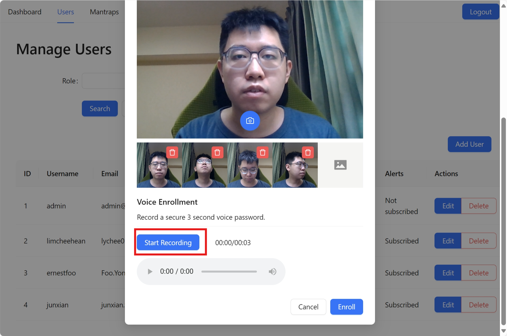
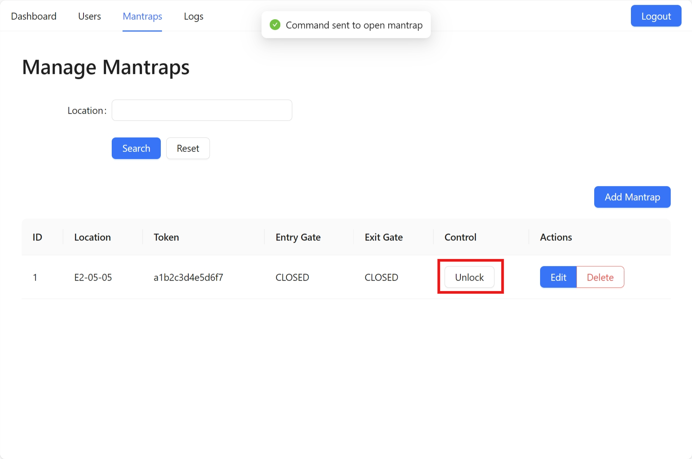

# Web Portal User Guide

This user guides contains instructions for using the GateGuard Security Portal.

## User Roles
A user can have the role of `admin`, `security` or `personnel`.
Only users with the role of `admin` and `security` will be able to access the web portal.
The list of pages available for each user role is as follows.

Admin:
- Dashboard (/)
- Manage Users (/users)
- Manage Mantrap (/mantraps)
- System Logs (/logs)

Security:
- Dashboard (/)
- Manage Mantrap (/mantraps) - Limited features
- System Logs (/logs)

## Login
To login to the GateGuard Security Web Portal, visit https://localhost/. \
URL may change depending on deployment configuration.

Enter your username and password, then select Login.\
If you forgot your username or password, please contact an administrator to retrieve your username or reset your password.

## Real-Time Monitoring
To monitor the status of the mantrap, select the Dashboard tab on the navigation bar.\
The dashboard will provide a visual representation of the current mantrap status.

System is in idle.

Movement has been detected. Waiting for user to approach camera for facial authentication.

Detecting and verifying user's face.

User has been verified. Door has opened and waiting for user to enter the mantrap.

Detecting the number of people in the mantrap to prevent tailgating.

Re-verifying user's face inside the mantrap.

Verifying user's voice as a second authentication factor.

User has been verified. Door has opened and waiting for the user to exit the mantrap.

User is exiting the mantrap.

An alert has been triggered, due to tailgating or authentication failure at the internal gate.

## User Management

### View Users
To view the list of users in the system, select the Users tab on the navigation bar.\
This feature is only available to administrators.

### Filter Users by Role
Users can be filtered by role using the Role dropdown.

### Add New User

To add a user, select the add user button and enter the following details.
- **Username**: Name to log into the web portal. Must be unique.
- **Email**: Email of the user. Alerts will be sent to this email if subscribed.
- **Password**: Password to log into the web portal. Requires a combination of uppercase, lowercase, numeric and special characters between 8 - 32 characters long.
- **Role**: Select between `Admin`, `Security` and `Personnel`. Note that `Personnel` will not have access to the portal and will enroll their biometrics through an administrator account.
- **Subscribe to Alerts**: If selected, alerts will be sent to the email of the user. Applicable to `Admin` and `Security` only.

### Edit User
To edit the details of a user, select the Edit button for the corresponding user and modify the details accordingly.
The existing details of the user (except for the password) will be pre-populated.

Note:
- Unless you are resetting the password, leave the password field blank.\
- The username cannot be changed if biometrics are enrolled, as it is used as the key for authentication at the mantrap.
To update the username, first delete biometrics for the user, and re-enroll again once completed.
- User will lose their alert subscription status if the role is changed to `Personnel`.

### Delete User
To delete an existing user, select the Delete button for the corresponding user and select OK to confirm.

Note:
- The current logged in account cannot be deleted.
- After a user is deleted, access to all mantraps will be revoked.

## Biometrics Enrollment
The biometrics enrollment interface is only available to administrators.\
Users should only perform biometrics enrollment under the supervision of an administrator.\
The administrator is responsible for verifying the user's identity before allowing them to proceed with the enrollment.

### Enroll Biometrics
To enroll biometrics, select the Enroll button for the corresponding user.

Enable camera permissions when prompted.\
Capture 5 images of the face at different angles by clicking the camera icon.\
To delete and retake an image, click on the trashcan icon for the corresponding image.

Enable microphone permissions when prompted.\
Record a 3-second voice passphrase by selecting the Start Recording button.
You may also playback the recording using the built in audio player, and re-record by selecting the Delete Recording button.

Once completed, select the Enroll button. Once successful, the user will have access to the secured facility.

### Delete Biometrics
To delete biometrics, select the Remove button for the corresponding user.\
Once biometrics is revoke, the user will lose access to all mantraps until biometrics are enrolled again.

## Mantrap Management

### View Mantraps
To view the list of mantraps, select the Mantraps tab on the navigation bar.\
This page is available to both Administrators and Security, although Security will not be able to add, edit and delete mantraps.

### Filter Mantraps by Location
Mantraps can be filtered by location using the Location input field.

### Add Mantrap
To add a new mantrap, select Add Mantrap button and fill in the mantrap location.\
This operation is only available to Administrators.

### Edit Mantrap
To edit a mantrap, select the Edit button for the corresponding mantrap and update the location.\
This operation is only available to Administrators.

### Delete Mantrap
To delete a mantrap, select the Delete button for the corresponding mantrap and select OK to confirm.\
This operation is only available to Administrators.

### Override Gate
When an alert is triggered, Administrators and Security can manually override the gate controls to unlock and lock the gate.

## Access Logs Monitoring

### View Access Logs
Access logs can be viewed by selecting the Logs tab from the navigation bar.

### Filter Logs by Category and User ID
Access logs can be filter by Category and User ID using the search filter.

### View Alert Log Image
When an alert is triggered, such as when tailgating or impersonation is suspected, an image will be captured and can be viewed from the logs page.

## Email Alerts
Users subscribed to alerts will receive alert emails when a suspicious event (tailgating or impersonation) is detected.
